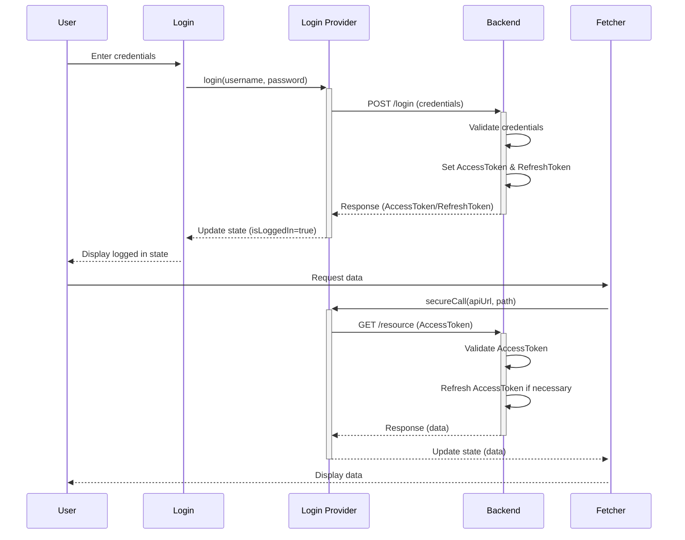

# edu-login-provider

```mermaid
sequenceDiagram
    participant User
    participant Login
    participant LoginProvider as Login Provider
    participant Backend
    participant Fetcher

    User->>+Login: Enter credentials
    Login->>+LoginProvider: login(username, password)
    LoginProvider->>+Backend: POST /login (credentials)
    Backend->>Backend: Validate credentials
    Backend->>Backend: Set AccessToken & RefreshToken
    Backend-->>-LoginProvider: Response (AccessToken/RefreshToken)
    LoginProvider-->>-Login: Update state (isLoggedIn=true)
    Login-->>User: Display logged in state

    User->>+Fetcher: Request data
    Fetcher->>+LoginProvider: secureCall(apiUrl, path)
    LoginProvider->>+Backend: GET /resource (AccessToken)
    Backend->>Backend: Validate AccessToken
    Backend->>Backend: Refresh AccessToken if necessary
    Backend-->>-LoginProvider: Response (data)
    LoginProvider-->>-Fetcher: Update state (data)
    Fetcher-->>User: Display data
```

